# Diagrama de Componentes — ZeroTrust Auth Platform

**Versión:** 1.0  
**Fecha:** 2026-03-31  
**Autor:** Miguel Angel Zhunio Remache  

---

## Diagrama

```mermaid
graph TB
    %% ── Clientes externos ──
    Client["Cliente / Admin Dashboard"]
    
    %% ── Infraestructura de entrada ──
    Gateway["API Gateway"]

    Client -->|HTTPS| Gateway

    %% ══════════════════════════════════════════
    %% AUTHENTICATION SERVICE
    %% ══════════════════════════════════════════
    subgraph AuthN["Authentication Service — Java + Spring Boot"]
        AuthN_RL["Rate Limiting"]
        AuthN_CA["Credential Authentication"]
        AuthN_MFA["MFA (TOTP / WebAuthn)"]
        AuthN_TM["Token Management"]
        AuthN_EP["Event Publisher"]

        AuthN_RL -->|"pasa → request"| AuthN_CA
        AuthN_CA -->|"usuario verificado"| AuthN_MFA
        AuthN_MFA -->|"segundo factor OK"| AuthN_TM
        AuthN_TM -.->|"evento"| AuthN_EP
        AuthN_RL -.->|"evento"| AuthN_EP
        AuthN_CA -.->|"evento"| AuthN_EP
        AuthN_MFA -.->|"evento"| AuthN_EP
    end

    %% ══════════════════════════════════════════
    %% AUTHORIZATION SERVICE
    %% ══════════════════════════════════════════
    subgraph AuthZ["Authorization Service — Java + Spring Boot"]
        AuthZ_AE["Access Evaluator"]
        AuthZ_EP["Event Publisher"]

        AuthZ_AE -.->|"evento"| AuthZ_EP
    end

    %% ══════════════════════════════════════════
    %% ML / POLICY ENGINE
    %% ══════════════════════════════════════════
    subgraph MLService["ML / Anomaly Detection + Policy Engine — Python + FastAPI"]
        ML_AD["Anomaly Detection"]
        ML_PE["Policy Engine"]
        ML_EP["Event Publisher"]

        ML_AD -->|"score de confianza"| ML_PE
        ML_PE -.->|"evento"| ML_EP
        ML_AD -.->|"evento"| ML_EP
    end

    %% ══════════════════════════════════════════
    %% AUDIT LOG SERVICE
    %% ══════════════════════════════════════════
    subgraph AuditLog["Audit Log Service — Java + Spring Boot"]
        AL_EI["Event Ingestion"]
        AL_LQ["Log Query & Integrity"]
        AL_EP["Event Publisher"]

        AL_EI -.->|"evento"| AL_EP
    end

    %% ══════════════════════════════════════════
    %% INFRAESTRUCTURA DE SOPORTE
    %% ══════════════════════════════════════════
    Kafka["Apache Kafka"]
    Redis[("Redis")]
    PG_AuthN[("PostgreSQL — AuthN")]
    PG_AuthZ[("PostgreSQL — AuthZ")]
    Mongo_ML[("MongoDB — ML")]
    Mongo_Audit[("MongoDB — Audit")]
    Obs["Prometheus + Grafana + OpenTelemetry"]

    %% ── Flujo sincrónico principal ──
    Gateway -->|"REST síncrono"| AuthN_RL
    AuthN_TM -->|"respuesta con JWT"| Gateway
    Gateway -->|"REST síncrono"| AuthZ_AE
    AuthZ_AE -->|"REST síncrono"| ML_PE

    %% ── Dependencias externas: Authentication Service ──
    AuthN_RL --- Redis
    AuthN_CA --- PG_AuthN
    AuthN_MFA --- PG_AuthN
    AuthN_TM --- Redis
    AuthN_EP -->|"publica"| Kafka

    %% ── Dependencias externas: Authorization Service ──
    AuthZ_AE --- PG_AuthZ
    AuthZ_EP -->|"publica"| Kafka

    %% ── Dependencias externas: ML / Policy Engine ──
    ML_AD --- Mongo_ML
    ML_AD ---|"consume"| Kafka
    ML_EP -->|"publica"| Kafka

    %% ── Dependencias externas: Audit Log Service ──
    AL_EI ---|"consume"| Kafka
    AL_EI --- Mongo_Audit
    AL_LQ --- Mongo_Audit
    AL_EP -->|"publica"| Kafka

    %% ── Observabilidad ──
    AuthN -.->|"métricas"| Obs
    AuthZ -.->|"métricas"| Obs
    MLService -.->|"métricas"| Obs
    AuditLog -.->|"métricas"| Obs
```

---

## Leyenda

| Línea | Significado |
|---|---|
| `──▶` Sólida con flecha | Comunicación sincrónica (HTTP/REST) |
| `──` Sólida sin flecha | Dependencia de datos (base de datos) |
| `- -▶` Punteada con flecha | Comunicación asíncrona (eventos Kafka) o métricas |

---

## Componentes por servicio

### Authentication Service

| Componente | Responsabilidad | Dependencias externas |
|---|---|---|
| **Rate Limiting** | Algoritmo Token Bucket con contadores distribuidos. Primer filtro de todo request. | Redis |
| **Credential Authentication** | Registro y verificación de credenciales contra base de datos. | PostgreSQL |
| **MFA (TOTP / WebAuthn)** | Verificación de segundo factor — códigos temporales o autenticación de dispositivo. | PostgreSQL (secretos TOTP, claves públicas WebAuthn) |
| **Token Management** | Emisión, renovación, revocación de JWT (RS256) y gestión de blacklist. | Redis |
| **Event Publisher** | Publica eventos de autenticación a Kafka para consumo asíncrono. | Kafka |

### Authorization Service

| Componente | Responsabilidad | Dependencias externas |
|---|---|---|
| **Access Evaluator** | Extrae atributos del JWT, consulta políticas ABAC y delega evaluación al Policy Engine vía HTTP. | PostgreSQL, ML/Policy Engine (HTTP) |
| **Event Publisher** | Publica decisiones de acceso a Kafka. | Kafka |

### ML / Anomaly Detection + Policy Engine

| Componente | Responsabilidad | Dependencias externas |
|---|---|---|
| **Anomaly Detection** | Consume eventos de Kafka para entrenamiento. Calcula score de confianza por request. | MongoDB, Kafka |
| **Policy Engine** | Evalúa políticas ABAC consumiendo score del ML en el mismo proceso. | Ninguna (recibe datos por parámetro) |
| **Event Publisher** | Publica resultados de evaluación a Kafka. | Kafka |

### Audit Log Service

| Componente | Responsabilidad | Dependencias externas |
|---|---|---|
| **Event Ingestion** | Consume eventos de Kafka y los persiste con hash chaining inmutable. | Kafka, MongoDB |
| **Log Query & Integrity** | Expone endpoints de consulta con filtros y verificación de integridad de la cadena. | MongoDB |
| **Event Publisher** | Publica eventos propios del servicio a Kafka. | Kafka |

---

## Trazabilidad con Threat Model

| Amenaza | Componente(s) que mitigan |
|---|---|
| E-01: JWT Manipulation | Token Management (RS256 + validación estricta) |
| E-02: ABAC Policy Misconfiguration | Access Evaluator + Policy Engine (policy testing, deny by default) |
| E-03: Token Reuse After Revocation | Token Management (revocación inmediata Redis + TTL) |
| S-01: Credential Stuffing | Rate Limiting + MFA + Anomaly Detection |
| S-02: Phishing de tokens | MFA — WebAuthn vinculado al dominio |
| T-01: Audit Log Tampering | Event Ingestion (hash chaining) + Log Query & Integrity (verificación) |
| R-01: Negación de acciones administrativas | Event Ingestion (registro inmutable por evento) |
| I-01: Exposición de datos en errores | Todos los servicios (manejo centralizado de errores) |
| D-01: Authentication Endpoint Flooding | Rate Limiting (Token Bucket) + Anomaly Detection |

---

## Referencias

- [UML Component Diagram — IBM](https://developer.ibm.com/articles/the-component-diagram/)
- [C4 Model — Component Diagram](https://c4model.com/#ComponentDiagram)
- [STRIDE Threat Model — Microsoft](https://learn.microsoft.com/en-us/azure/security/develop/threat-modeling-tool-threats)
