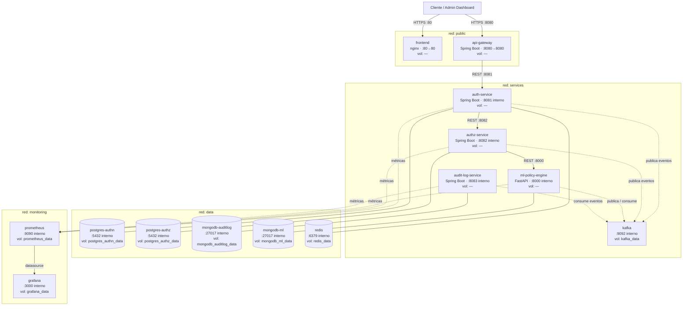

# Diagrama de Despliegue — ZeroTrust Auth Platform

**Versión:** 1.0  
**Fecha:** 2026-03-31  
**Autor:** Miguel Angel Zhunio Remache  

---

## Diagrama

---

## Leyenda

| Línea | Significado |
|---|---|
| `──▶` Sólida con flecha | Comunicación sincrónica (HTTP/REST) |
| `──` Sólida sin flecha | Dependencia de datos (lectura / escritura a base de datos) |
| `- -▶` Punteada con flecha | Comunicación asíncrona (eventos Kafka) o scrape de métricas |

---

## Contenedores

| Contenedor | Imagen | Puerto interno | Puerto host | Red(es) |
|---|---|---|---|---|
| frontend | nginx | 80 | 80 | public |
| api-gateway | Spring Boot | 8080 | 8080 | public, services |
| auth-service | Spring Boot | 8081 | — | services, data, monitoring |
| authz-service | Spring Boot | 8082 | — | services, data, monitoring |
| ml-policy-engine | FastAPI | 8000 | — | services, data, monitoring |
| audit-log-service | Spring Boot | 8083 | — | services, data, monitoring |
| kafka | Apache Kafka | 9092 | — | services |
| postgres-authn | PostgreSQL | 5432 | — | data |
| postgres-authz | PostgreSQL | 5432 | — | data |
| mongodb-auditlog | MongoDB | 27017 | — | data |
| mongodb-ml | MongoDB | 27017 | — | data |
| redis | Redis | 6379 | — | data |
| prometheus | Prometheus | 9090 | — | monitoring |
| grafana | Grafana | 3000 | — | monitoring |

> Solo `frontend` (:80) y `api-gateway` (:8080) exponen puertos al host. El resto opera exclusivamente en redes internas Docker.

---

## Redes Docker

| Red | Propósito | Contenedores |
|---|---|---|
| `public` | Tráfico externo — único punto de entrada al sistema | frontend, api-gateway |
| `services` | Comunicación entre microservicios y mensajería asíncrona | api-gateway, auth-service, authz-service, ml-policy-engine, audit-log-service, kafka |
| `data` | Acceso a bases de datos — aislado del exterior | auth-service, authz-service, ml-policy-engine, audit-log-service, postgres-authn, postgres-authz, mongodb-auditlog, mongodb-ml, redis |
| `monitoring` | Recolección y visualización de métricas operacionales | auth-service, authz-service, ml-policy-engine, audit-log-service, prometheus, grafana |

> Los 4 microservicios pertenecen a las redes `services`, `data` y `monitoring` simultáneamente — necesitan comunicarse con Kafka, escribir en sus bases de datos y exponer métricas a Prometheus.  
> El `api-gateway` pertenece a `public` y `services` — es el único contenedor con acceso al exterior y a la red interna de servicios.

---

## Volúmenes Docker

| Volumen | Contenedor | Datos que persiste |
|---|---|---|
| `kafka_data` | kafka | Mensajes retenidos con offset — eventos no consumidos sobreviven reinicios |
| `postgres_authn_data` | postgres-authn | Usuarios, credenciales hasheadas, configuración MFA |
| `postgres_authz_data` | postgres-authz | Políticas ABAC |
| `mongodb_auditlog_data` | mongodb-auditlog | Eventos inmutables con hash chaining |
| `mongodb_ml_data` | mongodb-ml | Datos históricos de comportamiento y modelo ML entrenado |
| `redis_data` | redis | Refresh tokens activos, blacklist de tokens revocados, contadores de rate limiting |
| `prometheus_data` | prometheus | Métricas históricas de tiempo (latencia, contadores, estados) |
| `grafana_data` | grafana | Dashboards configurados y alertas |

> `frontend`, `api-gateway` y los 4 microservicios no tienen volumen — su estado vive en las bases de datos, no en el contenedor.

---

## Decisiones arquitectónicas

| Decisión | Justificación |
|---|---|
| Un solo puerto expuesto al host por tipo de tráfico | `frontend :80` para la UI, `api-gateway :8080` para la API. El resto opera en redes internas — ningún microservicio ni base de datos es accesible directamente desde el exterior. |
| Cuatro redes segmentadas | Aísla responsabilidades: `public` para entrada, `services` para lógica, `data` para almacenamiento, `monitoring` para observabilidad. Una brecha en un microservicio no da acceso directo a la red de datos. |
| Database per service con instancias separadas | PostgreSQL x2 y MongoDB x2 — cada servicio es dueño exclusivo de su instancia. Respeta el principio de database per service documentado en la Arquitectura Detallada. |
| Volumen en Kafka | Kafka retiene mensajes en disco. Sin volumen, los eventos no consumidos se pierden al reiniciar — crítico para el Audit Log Service que puede estar temporalmente caído. |
| OpenTelemetry sin contenedor propio | OpenTelemetry instrumenta el código de cada microservicio como librería. No es un proceso separado — exporta métricas directamente a Prometheus desde dentro de cada servicio. |

---

## Referencias

- [Docker Compose Networking](https://docs.docker.com/compose/networking/)
- [Docker Volumes](https://docs.docker.com/storage/volumes/)
- [Spring Boot Docker](https://spring.io/guides/topicals/spring-boot-docker/)
- [FastAPI Docker](https://fastapi.tiangolo.com/deployment/docker/)
- [Kafka Docker](https://kafka.apache.org/documentation/#docker)
